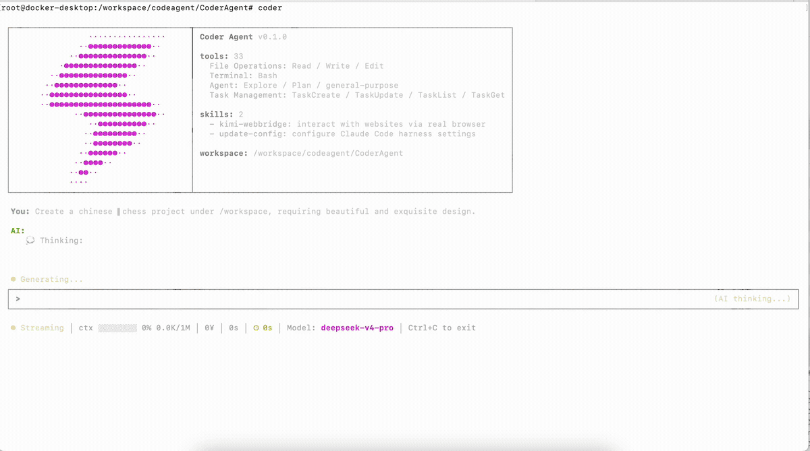

# CoderAgent

<div align="center">

[](LICENSE)
[](https://nodejs.org)
[](https://www.typescriptlang.org/)
[](https://deepseek.com)

**A fully open-source (Apache 2.0) terminal AI programming assistant — the free alternative to Claude Code.**

</div>

<div align="center">

</div>

CoderAgent is a powerful CLI coding agent that runs entirely in your terminal. It can read, write, edit files, execute shell commands, search code, and more — all through natural language conversation. Built with Ink/React for a beautiful TUI experience.

> **99.9%** of the code in this project was generated by **DeepSeek** models. We believe the best way to demonstrate an AI's coding capability is to build a coding tool with it.

---

## Why CoderAgent?

| | Claude Code | CoderAgent |
|---|---|---|
| **License** | Proprietary | Apache 2.0 |
| **Source** | Closed | Fully open |
| **Provider** | Anthropic only | Anthropic / DeepSeek / OpenAI |
| **Pricing** | Per-token billing | Bring your own key |
| **Extensibility** | Limited | Full plugin architecture |

---

## Quick Start

### Prerequisites

- **Node.js >= 22**
- An API key from [DeepSeek](https://platform.deepseek.com), [Anthropic](https://console.anthropic.com), or [OpenAI](https://platform.openai.com)

### Install

```bash
git clone https://github.com/AgenticMatrix/CoderAgent.git
cd CoderAgent
./install.sh --local
```

### Development

```bash
npm run dev
```

### Configure

```bash
# First-time setup wizard
coder setup

# Or manually edit ~/.coder/settings.json
```

### Start Coding

```bash
# Interactive session
coder

# One-shot query
coder --print "Explain the src/core/query-engine.ts file"

# Switch model
coder --model
coder -m "deepseek/deepseek-v4-pro"
```

---

## Features

- **Beautiful TUI** — Built with [Ink](https://github.com/vadimdemedes/ink) + React 19, full terminal rendering
- **Multi-Provider** — Anthropic (Claude), DeepSeek, OpenAI-compatible endpoints
- **15+ Tools** — read, write, edit, bash, grep, glob, web-fetch, web-search, task management, todo
- **Streaming Tool Queue** — Tools enqueue and execute as they are parsed from the LLM stream, with bounded concurrency (default 32)
- **Streaming** — Real-time text, thinking, and tool-use streaming via ContentBlock events
- **Agent Loop** — Autonomous multi-turn reasoning with tool call execution
- **Permission System** — plan / ask / auto modes with risk-level classification
- **Context Management** — Token budget tracking and automatic compaction
- **Hook System** — Extensible lifecycle hooks
- **Skills** — Pluggable skill modules
- **Session Management** — Checkpoint, resume, fork sessions
- **Model Picker** — Interactive terminal model selection (`coder --model` / `coder setup`)

---

## Configuration

Edit `~/.coder/settings.json`:

```json
{
  "model_list": [
    {
      "model": [
        {
          "name": "deepseek-v4-pro",
          "price": {
            "input": 3,
            "cache_read_input": 0.025,
            "output": 6,
            "currency": "CNY",
            "unit": 1000000,
            "concurrency": 500,
            "max_context": 1000000
          }
        },
        {
          "name": "deepseek-v4-flash",
          "price": {
            "input": 1,
            "cache_read_input": 0.02,
            "output": 2,
            "currency": "CNY",
            "unit": 1000000,
            "concurrency": 2500,
            "max_context": 1000000
          }
        }
      ],
      "provider": "deepseek",
      "base_url": "https://api.deepseek.com/anthropic",
      "auth_token_env": "YOUR_DEEPSEEK_API_KEY"
    },
    {
      "model": [
        "claude-sonnet-2025",
        "opus-4.8"
      ],
      "provider": "anthropic",
      "base_url": "https://api.deepseek.com/anthropic",
      "auth_token_env": "YOUR_ANTHROPIC_API_KEY",
      "price": {
        "input": 3,
        "output": 15,
        "currency": "USD",
        "unit": "1M tokens"
      }
    },
    {
      "model": [
        "gpt-5",
        "gpt-5-mini"
      ],
      "provider": "openai",
      "base_url": "https://api.openai.com/v1",
      "auth_token_env": "YOUR_OPENAI_API_KEY"
    }
  ],
  "default_model": "deepseek/deepseek-v4-pro",
  "max_tool_concurrency": 32,
  "theme": "dark"
}
```

---

## CLI Reference

| Command | Description |
|---|---|
| `coder` | Start interactive session |
| `coder "query"` | One-shot question |
| `coder --help` | Show help |
| `coder --version` | Print version |
| `coder --model` | Interactive model picker |
| `coder -m "provider/model"` | Set model directly |
| `coder setup` | First-time setup wizard |

---

## License

Apache 2.0 — fully open source. Use it, modify it, ship it.

---

<div align="center">

**Built with [DeepSeek](https://deepseek.com)** · **A [Claude Code](https://claude.ai/code) alternative**

</div>
